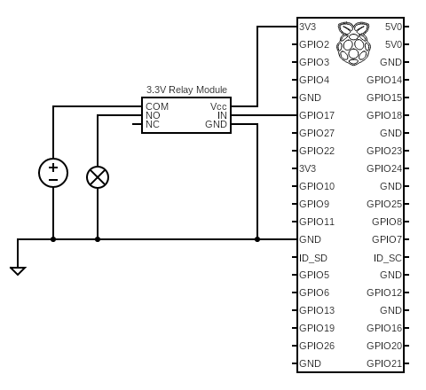

# The Light of Errors

## Usage

### Setup

This app requires *WiringPi* or one of the alternatives so that it can use the `gpio` shell command.

Also, it depends on RubyGems managed by Bundler. Run:

```bash
$ bundle install
```

The pins which the app fires are configured with `pins.yml` .

```bash
$ cp pins.yml{.sample,}
$ vim pins.yml
```

### Start the app

```bash
$ ./app.rb -e production
```

### Check

```bash
$ curl -XGET http://localhost:4567/
```

### Fire!

```bash
$ curl -XPOST http://localhost:4567/ -d ''
```

### Turn off

```bash
$ curl -XDELETE http://localhost:4567/
```

## Circuit

Here is an example:



(Drawn with [Circuit Diagram](https://www.circuit-diagram.org))
